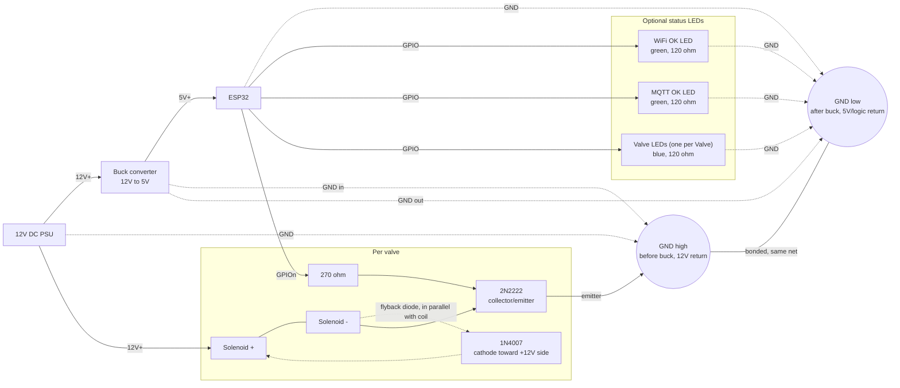

# ESP32 Irrigation Controller

ESP32 firmware for a garden valve controller. Drives 1–8 solenoid valves, talks MQTT, integrates with Home Assistant. Everything is configured through a web UI on the device — WiFi, MQTT, GPIO pins, all of it. No cloud, no account, 100% local.

## What this is

Not a serious project. I'm sharing it because it works well for me and might save someone else the effort.

- AI-coded (Claude Code). For this project, iteration speed and getting it deployed mattered more than code quality. That was the deliberate tradeoff.
- QA is manual/exploratory — I run it, watch it, fix what breaks. No test suite.
- No cloud, no account, no phoning home. MQTT to your own broker, that's it.

Use it, fork it, ask me questions. Don't expect production-grade code, and see [Safety notes](#safety-notes) before you wire up 12V solenoids.

<table>
  <tr>
    <td align="center"><b>Valves</b><br/></td>
    <td align="center"><b>Settings</b><br/></td>
    <td align="center"><b>Advanced</b><br/></td>
  </tr>
</table>

## Features

- WiFi setup via its own access point + captive portal (setup-AP pattern). Once WiFi's configured, the device drops the AP and is just a normal device on your network — the same web UI is reachable there.
- Config lives in the web UI, not the source: device name, MQTT broker, discovery namespace, valve count, GPIO per valve, status LED GPIOs, optional web password.
- Home Assistant MQTT auto-discovery — one switch entity per valve, no YAML.
- 1–8 valves, GPIO assigned per valve at runtime.
- Optional status LEDs (WiFi, MQTT, per-valve), independently wireable, can be disabled without losing their GPIO config.
- Valve runtime failsafe (configurable timeout forces a valve off if left on too long), all valves shut off on WiFi/MQTT disconnect.

## Hardware / build guide

### Base components

- ESP32 dev board
- Protoboard
- Jumper wires
- Buck converter (steps 12V down to 5V for the ESP32)
- 12V DC power supply — at least **1000mA + 500mA per additional valve**

**Optional:** two status LEDs + resistors (board built with green LEDs, 120Ω)

### Per valve

- 12V DC solenoid valve with garden hose adapters
- 1N4007 diode (flyback protection)
- 270Ω resistor (transistor base)
- 2N2222 transistor (low-side switch)

**Optional:** one status LED + resistor per valve (board built with a blue LED, 120Ω)

### Shopping list

**Base (one of each):**

- [ ] ESP32 dev board
- [ ] Protoboard
- [ ] Jumper wires
- [ ] Buck converter, 12V → 5V
- [ ] 12V DC power supply, ≥ 1000mA + 500mA per additional valve
- [ ] *(optional)* 2× LED + resistor for board status (green, 120Ω in this build)

**Per valve — multiply by however many valves you're building (1–8):**

- [ ] 12V DC solenoid valve + garden hose adapters
- [ ] 1N4007 diode
- [ ] 270Ω resistor
- [ ] 2N2222 transistor
- [ ] *(optional)* 1× LED + resistor for valve status (blue, 120Ω in this build)

### Wiring diagram



**In words:**

1. **Power**: 12V PSU feeds the buck converter, which steps down to 5V into the ESP32's 5V/VIN pin. The 12V PSU also feeds the solenoids directly (they run on 12V, not 5V).
2. **Per valve**: one leg of the solenoid coil goes to 12V+. The other leg goes to the 2N2222's collector, and also has the 1N4007 flyback diode wired across the coil (cathode/banded end toward +12V, anode toward the collector) to absorb the voltage spike when the coil switches off. The transistor's emitter goes back to **GND high** — the ground point on the 12V/PSU side, before the buck converter — not through the buck. The base goes to an ESP32 GPIO through a 270Ω resistor — the ESP32 switches the valve by driving that GPIO high/low (low-side switching).
3. **Optional valve LED**: GPIO → resistor → LED → **GND low** (the buck's 5V output-side ground, same as the ESP32's).
4. **Optional board status LEDs** (WiFi-OK, MQTT-OK): same pattern, GPIO → resistor → LED → GND low.
5. **Why two ground labels**: on a standard non-isolated buck converter, GND high and GND low are the same electrical net — but it's still worth routing deliberately rather than just grabbing whichever ground pad is closest. The solenoids' switching current is comparatively large and returns straight to GND high (near the PSU), instead of routing through the buck's own ground pins. That keeps that switching noise off the ground reference the buck's regulation loop and the ESP32's logic actually use (GND low) — cheap insurance against noise coupling, sometimes called star grounding. The low-current status LEDs don't carry enough current for this to matter, so they just return to GND low.
6. **If something doesn't light**: check continuity between GND high and GND low with a multimeter (should read ~0Ω) — if they're not actually bonded, nothing wired across the two domains will work, no matter how correct the rest of the circuit is.

GPIO pins aren't fixed anywhere — every valve and LED GPIO is assigned from the web UI after flashing. GPIO34/35/36/39 are input-only and can't drive anything; pick a different pin for any output (LED or transistor base).

## Firmware setup

### Build & flash

Requires [ESP-IDF](https://docs.espressif.com/projects/esp-idf/en/stable/esp32/get-started/index.html) (built against v6.0.1) targeting `esp32`.

```sh
idf.py set-target esp32
idf.py build
idf.py -p /dev/tty.YOUR_PORT flash monitor
```

### First boot: WiFi setup

No WiFi configured yet → the device opens its own access point (`Irrigation-Setup-XXXXXX`) with a captive portal. Same thing happens after a WiFi reset.

1. Connect a phone or laptop to that access point.
2. Setup page pops up automatically (captive portal); if it doesn't, go to `http://192.168.4.1/`.
3. Pick your WiFi network, enter the password, optionally set a device name.
4. Connect — device reboots onto your WiFi.

From here on the AP is gone and the device just sits on your network. Same web UI, now reachable at whatever IP your router hands it.

### Web interface

Find the device's IP (router's client list) and open it in a browser. Three tabs:

- **Valves** — toggle switches with live on/off status
- **Settings** — device name, MQTT broker/user/password, MQTT/HA discovery node ID, max valve runtime failsafe, optional web password for the whole UI
- **Advanced** — number of valves, GPIO per valve, GPIO per status LED, checkboxes to disable the WiFi/MQTT LEDs or the valve LEDs as a group without losing their GPIO assignment

Every save restarts the device to apply the change. Growing the valve count is two saves: save the new count and let it restart once (that's what reveals GPIO fields for the new valves), then fill those in and save again.

### Resetting WiFi

Hold the onboard BOOT button for 5 seconds while powering on — wipes the stored WiFi credentials, drops back into setup-AP mode.

### Home Assistant

MQTT configured → the device publishes HA discovery for each valve automatically, no YAML. The discovery/ACL namespace ("Discovery node ID" on the Settings page, defaults to `garden_devices`) is meant to be shared across a fleet of controllers, so one broker ACL rule (`homeassistant/switch/<node id>/#`) covers all of them. Give every controller the same value unless you're deliberately splitting ACL scopes.

### MQTT topics

`<device>` is the device name from Settings, `<node id>` the discovery node ID, `<n>` the valve index (`0`-based). Payloads are the plain strings `ON`/`OFF` unless noted.

| Topic | Direction | Purpose |
| --- | --- | --- |
| `cmnd/irrigation/<device>/<n>/POWER` | subscribe | Sets valve `<n>` — send `ON`/`OFF`. The device subscribes to this per valve on connect. |
| `stat/irrigation/<device>/<n>/POWER` | publish, retained | Reports valve `<n>`'s actual state — published on every state change and once per valve right after connecting. |
| `tele/irrigation/<device>/LWT` | publish, retained | Availability: `Online` on connect, `Offline` as the MQTT last-will if the device drops off ungracefully. |
| `homeassistant/switch/<node id>/<device>_<n>/config` | publish, retained | Home Assistant discovery payload for valve `<n>` (JSON, points HA at the two topics above). |

To drive a valve from any MQTT client without Home Assistant, publish `ON`/`OFF` to its `cmnd/.../POWER` topic and read back state from the matching `stat/.../POWER` topic.

## Safety notes

- This drives 12V solenoids and mains-adjacent wiring. If you're not comfortable with basic electronics/wiring safety, get someone who is to check your build before powering it on.
- The flyback diode across each solenoid coil is not optional — switching an inductive load without one will eventually damage the transistor (and possibly the ESP32).
- Size your 12V PSU for worst case: all valves energized simultaneously, plus the buck converter's own draw.
